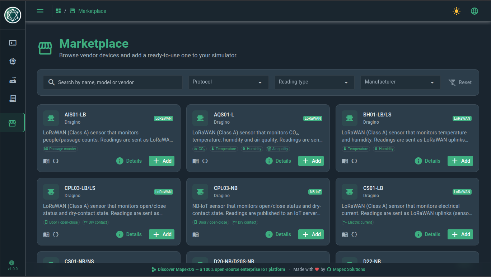
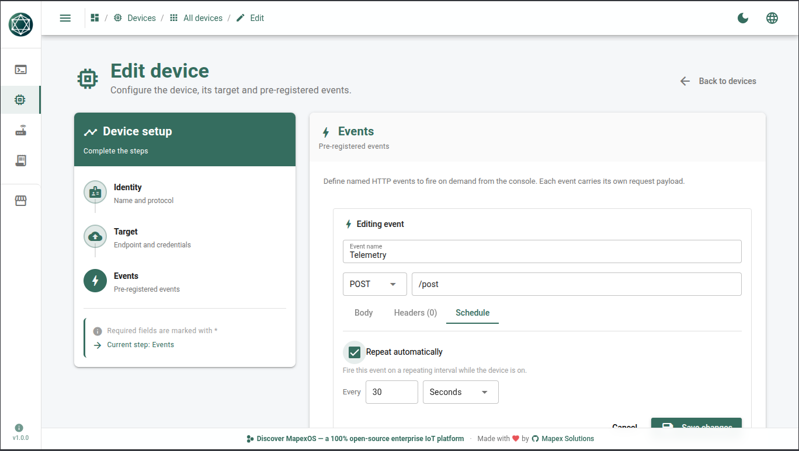
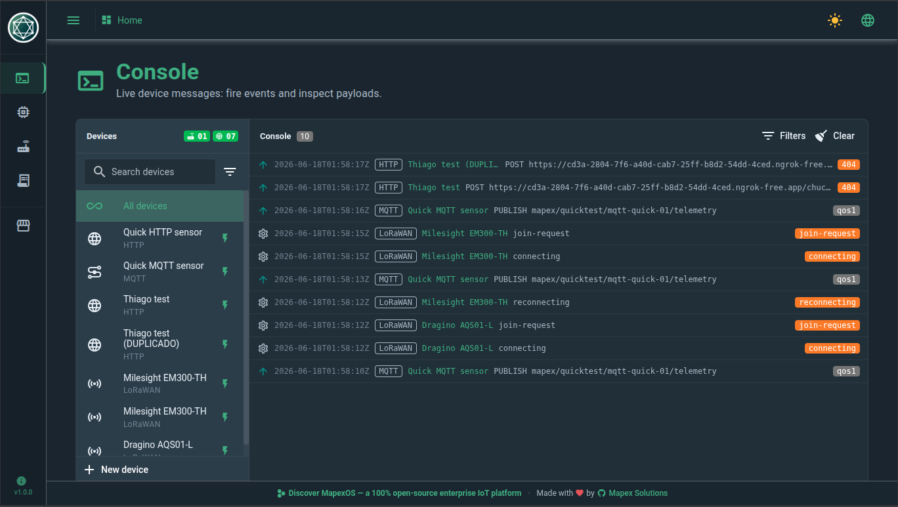

# Mapex Devices Simulator

> 🇧🇷 [Versão em português](./README_pt.md)

**Simulate real IoT devices — with no hardware to buy — and drive live traffic into
[MapexOS](https://github.com/Mapex-Solutions/mapexOS), or any platform that speaks
HTTP, MQTT or LoRaWAN.**

A local desktop app (Electron around a Go sidecar) that behaves like real devices
on the wire: it sends uplinks, receives downlinks, joins an LNS, and runs on a
schedule across **HTTP**, **MQTT** and **LoRaWAN** (Semtech UDP and Basics Station).

---

## The story

Every IoT platform hits the same wall the moment it gets real: to prove it works,
you need devices — lots of them, across vendors, protocols and regions.

On [MapexOS](https://github.com/Mapex-Solutions/mapexOS) that wall was sharper. The
platform's value isn't only ingesting telemetry — it's everything that happens
*after*: validating payloads, converting them, routing events, and wiring
**business rules in the workflow engine**. Exercising all of that honestly meant a
fleet of sensors on your desk… or a purchase order, a lead time, and a stack of
LoRaWAN gateways you'd provision once and rarely touch again.

The **Mapex Devices Simulator** was born to knock that wall down. It came straight
from a market demand: a way to **simulate devices without buying them**, so a team
can stand up realistic traffic in minutes. You spin devices up in software — a
Milesight EM300-TH here, a generic HTTP beacon there — point them at your MapexOS
stack, and watch real data flow. From there you can demo the platform end to end,
regression-test **every feature**, and **design and validate business rules with
the [MapexOS workflow engine](https://github.com/Mapex-Solutions/mapexOS)** — all
before a single physical device ships.

**It isn't locked to MapexOS.** Because it speaks vendor-neutral **HTTP, MQTT and
LoRaWAN**, you can point it at *any* destination — The Things Stack, ChirpStack, a
cloud IoT endpoint, your own broker or backend — and it just works. It was built for
MapexOS and shines there, but it works anywhere standard protocols do.

> **Want the full platform behind it?** Stand up MapexOS in minutes with
> **[mapexOSDeploy](https://github.com/Mapex-Solutions/mapexOSDeploy)** (Docker
> Compose), point the simulator at it, and watch your data flow end to end —
> ingestion, conversion, routing and the workflow engine.

---

## What you can do

- **Four protocols** — HTTP (send-only), MQTT (publish + subscribe), and LoRaWAN
  over Semtech UDP or Basics Station, with real OTAA/ABP crypto.
- **Live sessions** — persistent broker/LNS connections with auto-reconnect; fire
  events on demand or on a repeating schedule.
- **Console & logs** — a live WebSocket stream of every uplink, downlink and system
  frame, plus a persisted, filterable history.
- **One desktop binary** — Electron app that spawns the Go engine; nothing external
  to run.

The full, click-by-click catalog of capabilities lives in
[`RELEASES/1.0.0`](./RELEASES/1.0.0/README.md), and the hands-on walkthroughs in
[`quickTest`](./quickTest/README.md).

---

## See it in action

A quick tour — full set under [`images/`](images).

**Marketplace** — browse the catalog and filter by protocol, reading type or manufacturer.


**Device detail** — overview with description, reading-type tags and the vendor link.


**Codecs** — the official ChirpStack v4 and TTN decoders shipped with the device.


**Files** — datasheet and user manual, one click away.


**Device events** — configure named events and an auto-repeat schedule.


**Console** — fire events and watch live HTTP / MQTT / LoRaWAN messages with real payloads.


**Logs & Events** — the persisted history of every message.


---

## Powered by the Mapex Marketplace

The built-in **device marketplace** lets you browse a catalog and install a
pre-configured device in one click — then tweak its identity, gateway and
credentials before it lands in your simulator.

That catalog is served by
[**mapexMarketplace**](https://github.com/Mapex-Solutions/mapexMarketplace) — the
Mapex service that **hosts the devices**: their definitions, **payload codecs**,
**datasheets** and **manuals**. The simulator browses it online; installing a model
reuses the normal device-create path, so a marketplace device is just a regular
device with sensible defaults.

---

## Install

Grab the installer for your platform and run it — nothing else to set up, the Go
engine ships inside the app.

| Platform | File |
|----------|------|
| Debian / Ubuntu | `.deb` |
| RedHat / Fedora | `.rpm` |
| macOS | `.dmg` |
| Windows | `.exe` |

Step-by-step install per OS — and the one-time "unidentified developer" prompt
(the installers are unsigned) — is documented in
[`RELEASES/1.0.0` → Installation](./RELEASES/1.0.0/README.md#installation).

## Build from source

```bash
cd frontend
npm install
npm run build:electron      # builds the Go sidecar, then packages the desktop app
```

The packaged app lands in `frontend/app/dist/electron/Packaged/`. Run the build on
the OS you want to target (Linux → deb/rpm, macOS → dmg, Windows → exe).

---

## The MapexOS ecosystem

The simulator generates the device side; these projects are the platform that
receives, routes and acts on it.

- **[mapexOS](https://github.com/Mapex-Solutions/mapexOS)** — the core platform:
  ingestion, conversion, routing and the workflow engine.
- **[mapexMarketplace](https://github.com/Mapex-Solutions/mapexMarketplace)** — the
  catalog that hosts devices, codecs, datasheets and manuals.
- **[mapexOSDeploy](https://github.com/Mapex-Solutions/mapexOSDeploy)** — the
  runnable MapexOS distribution (Docker Compose + images).
- **[mapexMQTTBroker](https://github.com/Mapex-Solutions/mapexMQTTBroker)** — the
  MQTT broker the simulator's MQTT devices talk to.
- **[mapexLNS](https://github.com/Mapex-Solutions/mapexLNS)** — the LoRaWAN Network
  Server the simulator's LoRaWAN devices join.

---

<sub>Part of **MapexOS** — Mapex Solutions' open platform for data integration and
intelligent automation. **Connect. Automate. Scale.**</sub>
