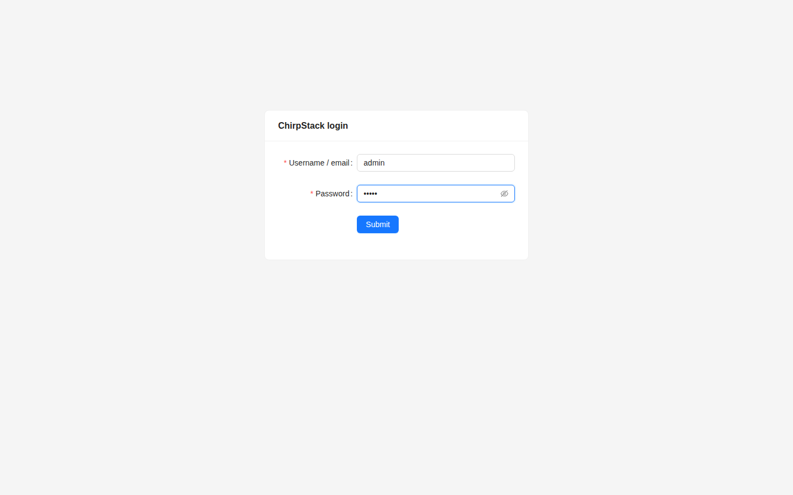
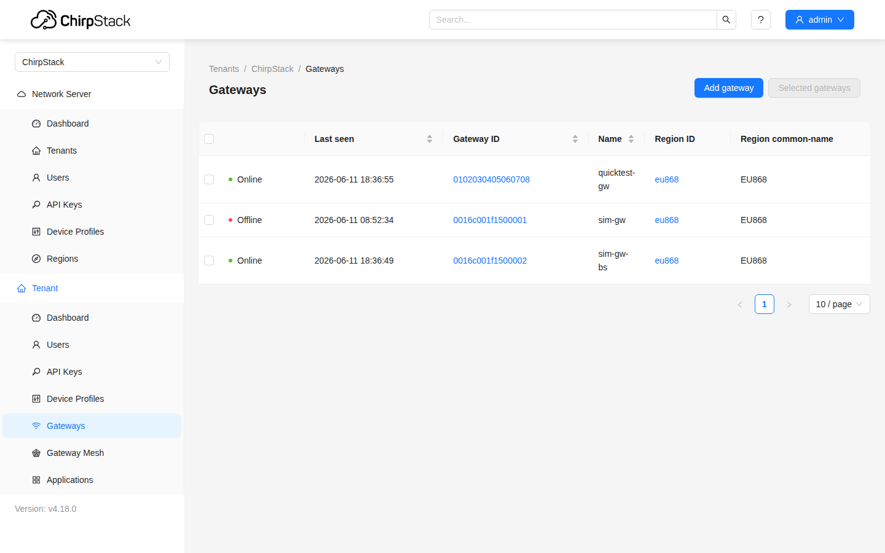
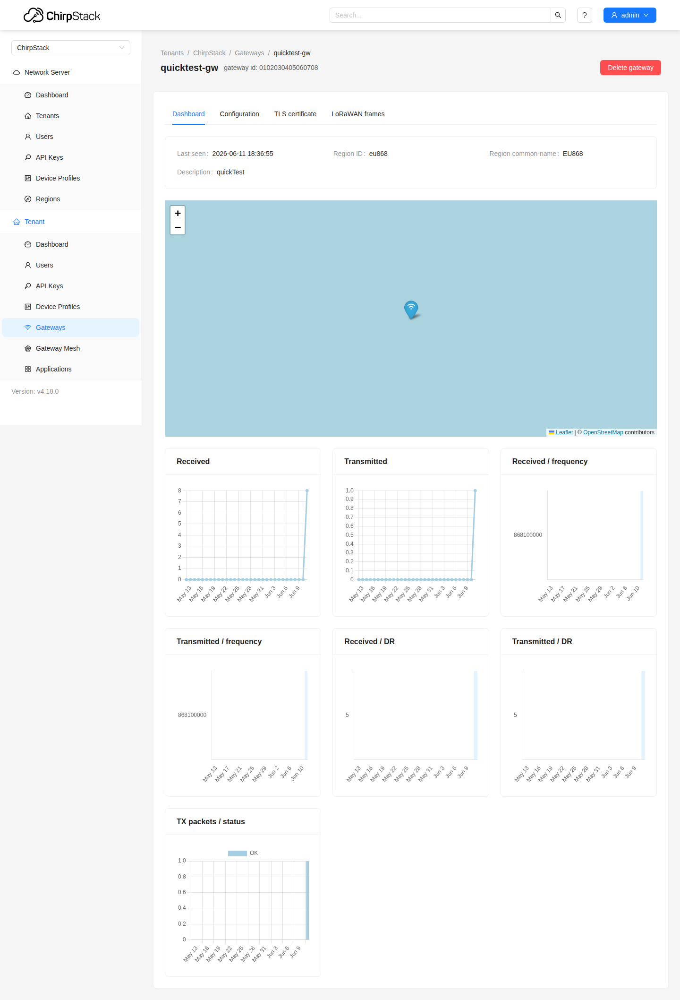
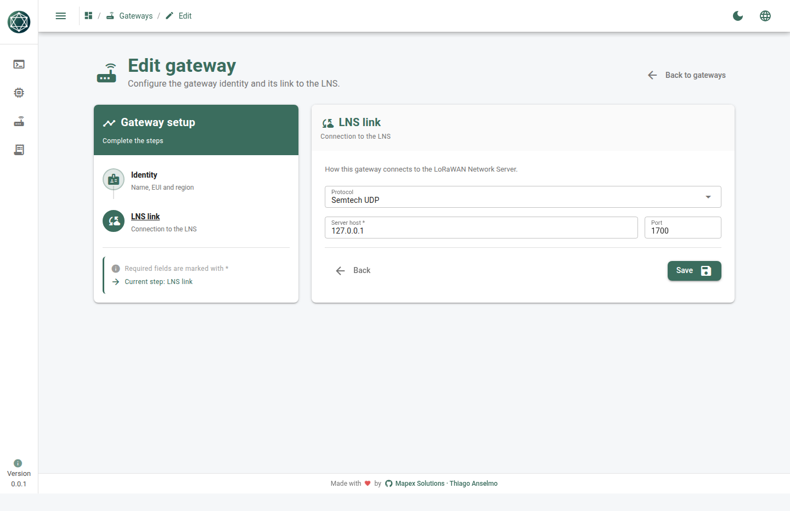
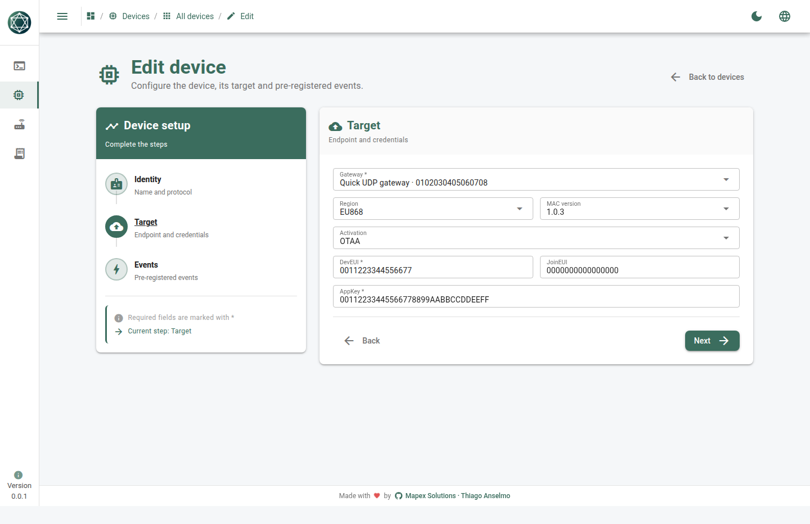
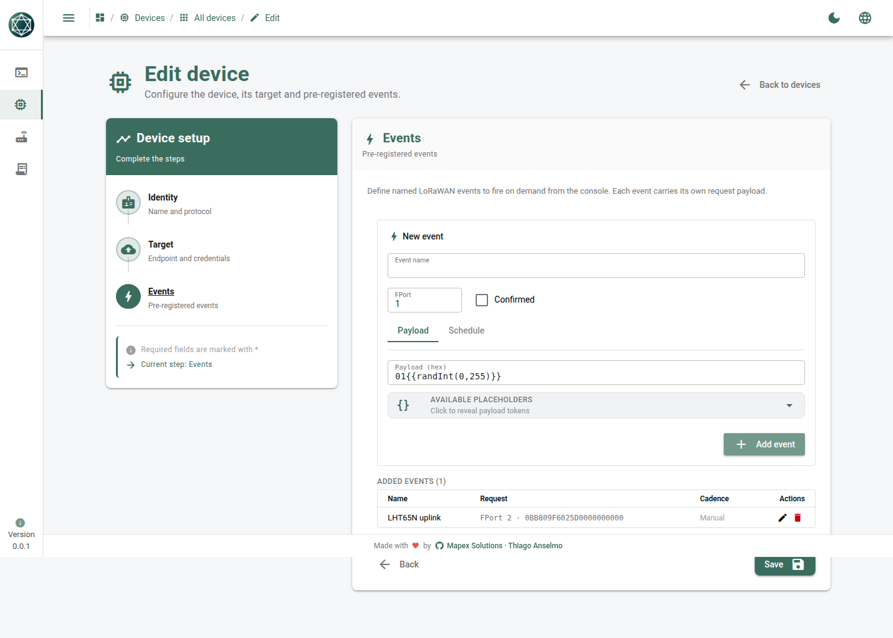
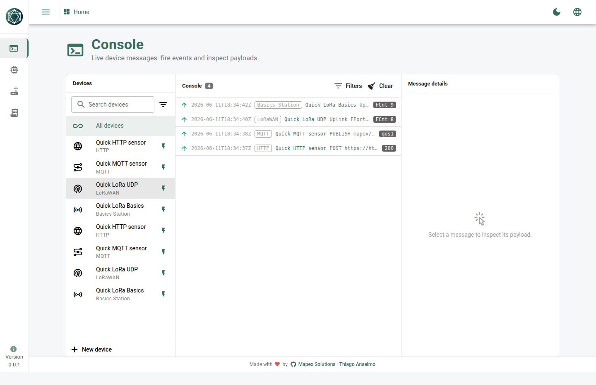
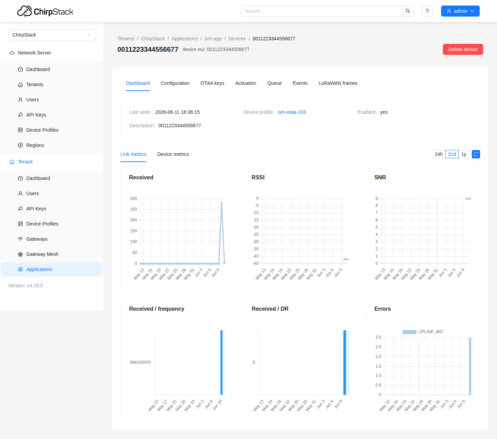
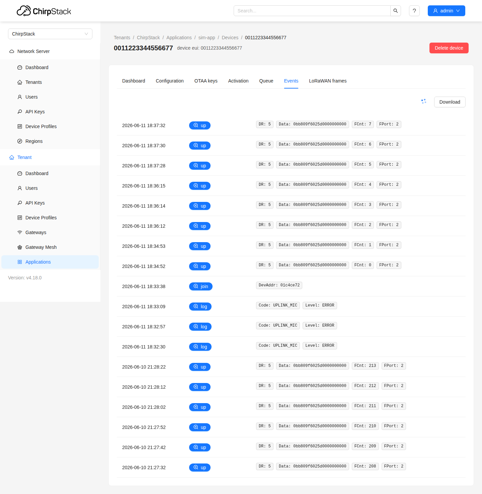
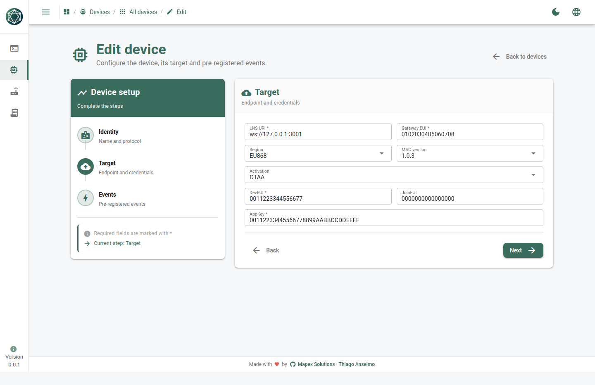

# Simulador de Dispositivos Mapex — passo a passo

Um tour guiado, com fotos. Ao final você terá enviado tráfego real por **HTTP**,
**MQTT** e **LoRaWAN** (Semtech UDP e Basics Station) e visto chegar — inclusive um
dispositivo LoRaWAN real descriptografado pelo **ChirpStack**.

> 🇺🇸 English version: [STEP-BY-STEP.en.md](./STEP-BY-STEP.en.md)

---

## 0. Subir o app

```bash
cd frontend
npm install            # só na primeira vez
npm run dev:electron   # compila o sidecar Go e abre o app desktop
```

O cabeçalho mostra um ponto de conexão: verde = o motor está acessível. Sem motor as
listas ficam vazias — não há dados falsos/seed.

O fluxo se repete para todos os protocolos:

1. **Devices → New device** — nome, Device ID, protocolo.
2. **Target** — a conexão (endpoint, broker ou chaves LoRaWAN).
3. **Events** — o payload a enviar.
4. **Save** e ligue o dispositivo em **Enabled**.
5. **Console** — veja os frames ao vivo; **Fire event** envia sob demanda.


---

## 1. HTTP

HTTP só envia: cada disparo é uma requisição e o status da resposta volta no frame
`up`.

**Target** — URL `https://httpbin.org`, Método `POST`, Auth `None`:


**Event** — Método `POST`, Path `/post`, Body (raw):

```json
{ "deviceId": "{{deviceId}}", "temperature": {{randInt(18,30)}}, "humidity": {{randInt(40,70)}} }
```


Ligue o dispositivo, abra o **Console** e clique em **Fire event** — surge um frame
`up` com status `200`:


Referência completa + caminho via API: [`http/`](./http/).

---

## 2. MQTT

MQTT mantém conexão viva com o broker: publica uplinks e, com **Receive** ligado,
transmite cada mensagem dos tópicos assinados como frame `down`.

**Target** — Broker `tcp://broker.hivemq.com:1883`, Base topic `mapex/quicktest`,
Receive **ligado**, Assinatura `mqtt-quick-01/cmd` (QoS 1):

> Os tópicos são relativos ao base topic — o motor prefixa com `mapex/quicktest`.


**Event** — Tópico `mqtt-quick-01/telemetry`, QoS 1, Body `{ "level": {{randInt(0,100)}} }`:


Ligue e abra o **Console**: aparece `connecting → connected → subscribed`, e o
disparo publica um frame `up` (`qos1`). Publique no tópico assinado a partir de
qualquer cliente para ver um frame `down` ao vivo:

```bash
mosquitto_pub -h broker.hivemq.com -t 'mapex/quicktest/mqtt-quick-01/cmd' -q 1 -m '{"cmd":"ping"}'
```


Referência completa: [`mqtt/`](./mqtt/).

---

## 3. LoRaWAN

Um sensor LoRaWAN trafega por um **gateway** que carrega o enlace até um LoRaWAN
Network Server (LNS). O sensor faz join OTAA e envia um uplink real do **Dragino
LHT65N** que o LNS descriptografa. Esta seção usa o **ChirpStack** como LNS.

### 3.1 Subir o ChirpStack

```bash
git clone https://github.com/chirpstack/chirpstack-docker
cd chirpstack-docker && docker compose up -d
# UI http://localhost:8088 (admin/admin) · UDP :1700 · Basics Station :3001
```



### 3.2 Provisionar o ChirpStack (para as chaves baterem)

Na UI do ChirpStack, dentro do tenant **ChirpStack**:

1. **Device Profiles → Add** — região `EU868`, versão MAC `LoRaWAN 1.0.3`, **OTAA**
   ligado. (Opcional: cole o codec do Dragino LHT65N para decodificar o payload.)
2. **Gateways → Add gateway** — Gateway ID `0102030405060708`, região `EU868`.
3. **Applications → (sua app) → Add device** — DevEUI `0011223344556677`,
   Join EUI `0000000000000000`, selecione o profile acima.
4. No dispositivo, **OTAA keys** — **Application key** `00112233445566778899AABBCCDDEEFF`.

> O ChirpStack guarda a chave única de um dispositivo 1.0.x no slot `nwk_key` — a UI
> chama de **Application key**. Para refazer um join, limpe os nonces usados antes:
> ```bash
> docker compose exec postgres psql -U chirpstack -d chirpstack \
>   -c "update device_keys set dev_nonces='{}'::jsonb where dev_eui=decode('0011223344556677','hex');"
> ```

A lista de gateways — o gateway do simulador fica **Online** assim que encaminha:



Ao abri-lo, aparecem as métricas do enlace (recebido/transmitido, frequência, DR):



### 3.3 LoRaWAN por Semtech UDP

No simulador, crie o **gateway** (Gateways → New gateway), passo **LNS link**:
Protocolo `Semtech UDP`, Host `127.0.0.1`, Porta `1700`:



Depois o **dispositivo** (Protocolo `LoRaWAN`), passo **Target** — Gateway = o de
cima, Região `EU868`, MAC `1.0.3`, Ativação `OTAA`, DevEUI `0011223344556677`,
JoinEUI `0000000000000000`, AppKey `00112233445566778899AABBCCDDEEFF`:



**Event** — um uplink real do LHT65N: FPort `2`, Payload (hex) `0BB809F6025D0000000000`:



Ligue e abra o **Console**: `join-request → join-accept → joined`, depois `Uplink
FCnt …`. O console mostra o fluxo multiprotocolo ao vivo — HTTP `200`, MQTT `qos1`,
LoRaWAN UDP uplink + downlink e Basics Station uplink + downlink:



No ChirpStack, o painel do dispositivo mostra os uplinks chegando (Received / RSSI /
SNR / frequência / DR):



A aba **Events** lista o join e os uplinks ao vivo conforme chegam:



Referência completa + caminho via API: [`lorawan-udp/`](./lorawan-udp/).

### 3.4 LoRaWAN por Basics Station

O mesmo sensor, mas o dispositivo carrega o **próprio enlace WebSocket Basics
Station** — sem gateway separado. Protocolo `Basics Station`, passo **Target** — LNS
URI `ws://127.0.0.1:3001`, Gateway EUI `0102030405060708`, mesmas região/chaves:



O mesmo evento LHT65N; ligue e o console mostra a conexão WebSocket, o join e o uplink:


Referência completa: [`lorawan-basic-station/`](./lorawan-basic-station/).

---

## Caminhos de um comando

Cada pasta tem um `curl.sh` que cria o dispositivo pela API REST do motor e dispara
uma vez:

```bash
bash quickTest/http/curl.sh
bash quickTest/mqtt/curl.sh
bash quickTest/lorawan-udp/curl.sh
bash quickTest/lorawan-basic-station/curl.sh
```

## Regerar as fotos

```bash
cd frontend && npm i -D playwright        # só a API; usa o seu Chrome instalado
npm run dev                                # SPA em :9100
node INTERNALS/capture-screenshots.mjs     # fotos do simulador
node INTERNALS/capture-chirpstack.mjs      # fotos do ChirpStack
```
