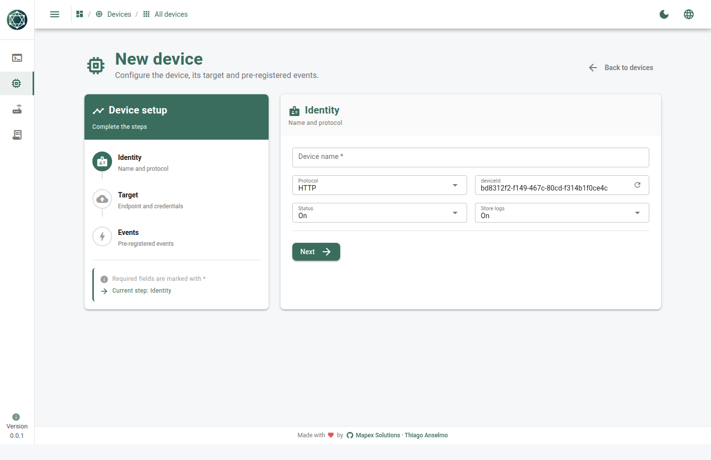
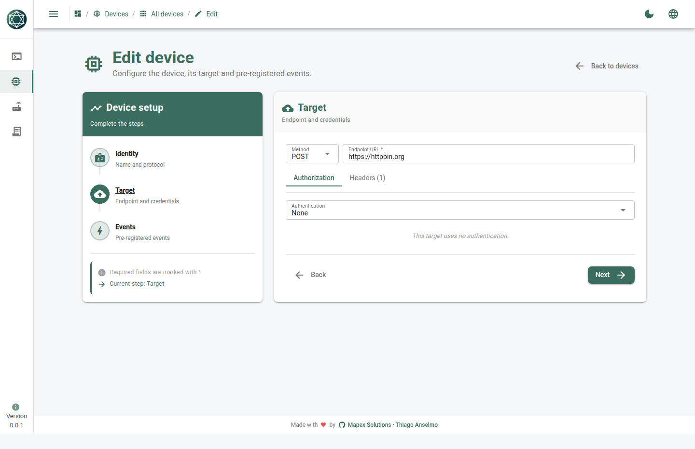
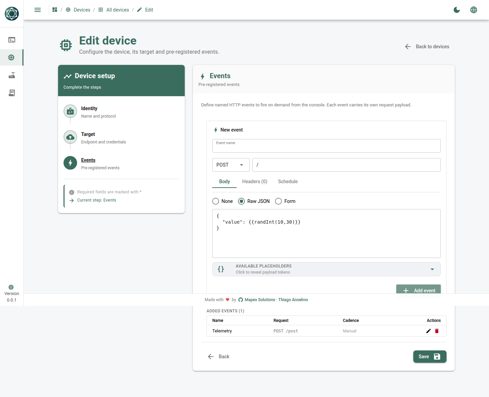
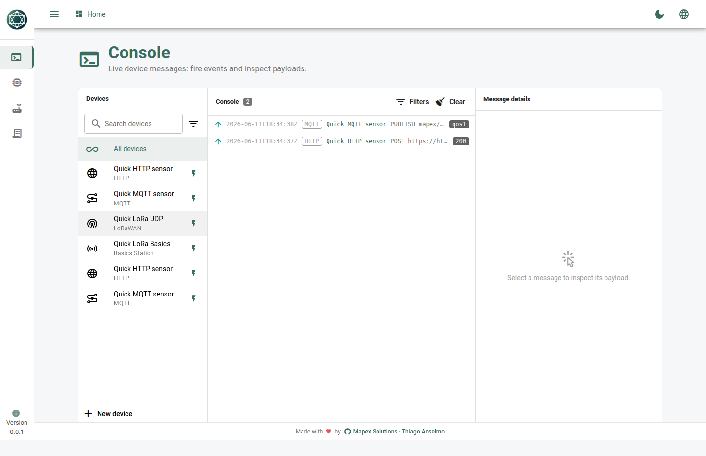

# Quick test de HTTP

> 🇺🇸 English version: [README.md](./README.md)

Um dispositivo HTTP é **somente de envio**: cada disparo é uma requisição one-shot ao
seu endpoint, e o status da resposta volta no frame `up`. Sem downlinks.

O alvo padrão abaixo é `https://httpbin.org` + path `/post`, que devolve um `200` de
qualquer lugar com internet. Troque pela sua própria URL de ingest quando quiser.

---

## Crie o dispositivo (UI)

**Devices → New device**

| Etapa | Campo | Cole isto |
|-------|-------|-----------|
| Info | Name | `Quick HTTP sensor` |
| Info | Device ID | `http-quick-01` |
| Info | Protocol | `HTTP` |
| Connection | URL | `https://httpbin.org` |
| Connection | Method | `POST` |
| Connection | Header | `Content-Type` = `application/json` |
| Connection | Auth | `None` |




### Adicione um evento

**Events → Add event**

| Campo | Cole isto |
|-------|-----------|
| Name | `Telemetry` |
| Method | `POST` |
| Path | `/post` |
| Body mode | `Raw` |
| Body | veja abaixo |

```json
{
  "deviceId": "{{deviceId}}",
  "temperature": {{randInt(18,30)}},
  "humidity": {{randInt(40,70)}}
}
```

`{{deviceId}}` e `{{randInt(a,b)}}` são renderizados pela engine no momento do envio,
então cada disparo carrega valores novos.



---

## Rode

1. **Save** o dispositivo e ligue o **Enabled** na lista.
2. Abra o **Console**.
3. Clique em **Fire event** na linha do dispositivo.
4. Um frame `up` aparece com status `200` e o corpo JSON renderizado.



---

## Alternativa em um comando (API)

Cria o mesmo dispositivo direto pela API REST da engine:

```bash
bash quickTest/http/curl.sh           # padrão http://127.0.0.1:5055
# ou aponte para outra engine:
SIM=http://127.0.0.1:5080 bash quickTest/http/curl.sh
```
