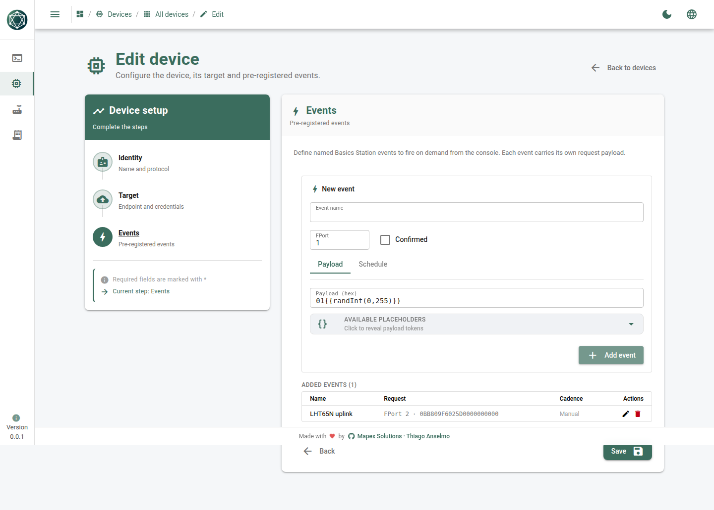

# LoRaWAN quick test — Basics Station

Same LoRaWAN sensor and same OTAA join as the UDP test, but the device carries its
**own Basics Station WebSocket link** to the LNS — no separate gateway entity. The
simulator connects to `ws://host:3001/gw/<gateway-eui>` (ChirpStack's Basics Station
gateway-bridge) and sends the real Dragino LHT65N uplink.

> Needs a running LNS with Basics Station enabled. ChirpStack's `chirpstack-docker`
> exposes it on `:3001`. See the repo root [`../README.md`](../README.md) §4.

---

## Register in ChirpStack (so the keys match)

- **Gateway** with EUI `0102030405060708` (the same EUI the device announces).
- **Device profile**: region `EU868`, MAC version `LoRaWAN 1.0.3`, OTAA enabled.
- **Device**: DevEUI `0011223344556677`, JoinEUI `0000000000000000`.
- **Application key (OTAA)**: `00112233445566778899AABBCCDDEEFF`.

(Same DevNonce-reset note as the UDP folder applies when re-running.)

---

## Create the device (UI)

**Devices → New device**

| Step | Field | Paste this |
|------|-------|------------|
| Info | Name | `Quick LoRa Basics` |
| Info | Device ID | `lora-bs-01` |
| Info | Protocol | `Basics Station` |
| Connection | LNS URI | `ws://127.0.0.1:3001` |
| Connection | Gateway EUI | `0102030405060708` |
| Connection | Region | `EU868` |
| Connection | MAC version | `1.0.3` |
| Connection | Activation | `OTAA` |
| Connection | DevEUI | `0011223344556677` |
| Connection | JoinEUI | `0000000000000000` |
| Connection | AppKey | `00112233445566778899AABBCCDDEEFF` |


> The simulator appends `/gw/<gateway-eui>` to the LNS URI automatically — give it
> just `ws://127.0.0.1:3001`.

### Add an event — a real LHT65N uplink

| Field | Paste this |
|-------|------------|
| Name | `LHT65N uplink` |
| FPort | `2` |
| Confirmed | off |
| Payload (hex) | `0BB809F6025D0000000000` |



---

## Run it

1. **Save**, flip **Enabled** on.
2. Open the **Console** — the WebSocket connects, then `join-request → join-accept →
   joined`, and **Fire event** produces an `up` frame.
3. ChirpStack shows the uplink (decoded if you added the LHT65N codec).


---

## One-command alternative (API)

```bash
bash quickTest/lorawan-basic-station/curl.sh   # defaults to http://127.0.0.1:5055
```
