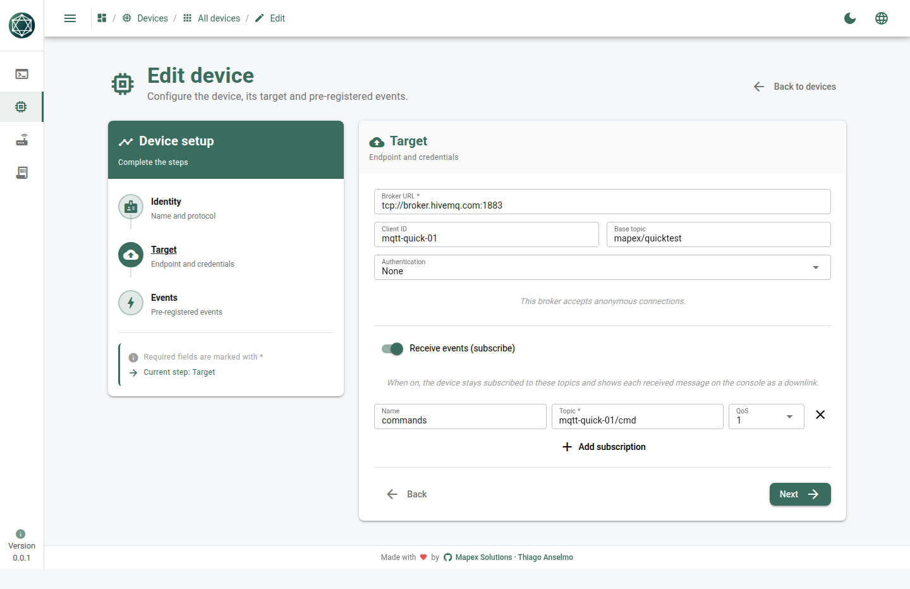
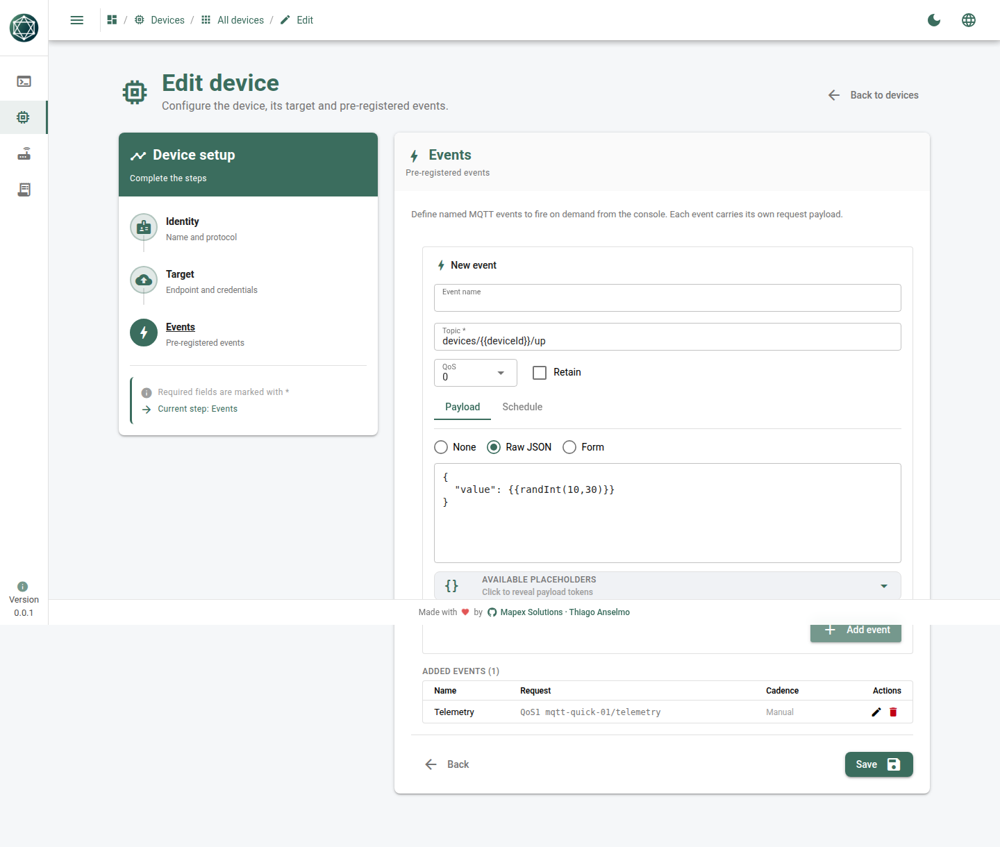
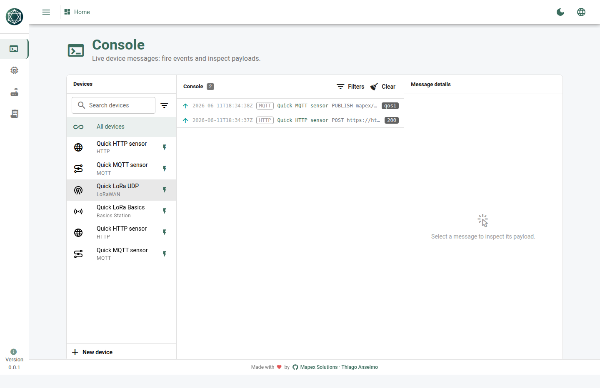

# MQTT quick test

> 🇧🇷 Versão em português: [README_pt.md](./README_pt.md)

An MQTT device keeps a **live connection** to a broker: it publishes uplinks and,
when **Receive** is on, stays subscribed to topics and streams every received
message to the console as a `down` frame.

The default broker below is the public `broker.hivemq.com` — no signup. Use your
own broker any time.

---

## Create the device (UI)

**Devices → New device**

| Step | Field | Paste this |
|------|-------|------------|
| Info | Name | `Quick MQTT sensor` |
| Info | Device ID | `mqtt-quick-01` |
| Info | Protocol | `MQTT` |
| Connection | Broker URL | `tcp://broker.hivemq.com:1883` |
| Connection | Client ID | `mqtt-quick-01` |
| Connection | Base topic | `mapex/quicktest` |
| Connection | Auth | `None` |
| Connection | **Receive events** | toggle **on** |
| Connection | Subscription | Name `commands` · Topic `mqtt-quick-01/cmd` · QoS `1` |

> Topics are **relative to the base topic** — the engine prepends `mapex/quicktest`,
> so the device actually subscribes to `mapex/quicktest/mqtt-quick-01/cmd`.



### Add an event

**Events → Add event**

| Field | Paste this |
|-------|------------|
| Name | `Telemetry` |
| Topic | `mqtt-quick-01/telemetry` (published to `mapex/quicktest/mqtt-quick-01/telemetry`) |
| QoS | `1` |
| Retain | off |
| Body mode | `Raw` |
| Body | see below |

```json
{
  "deviceId": "{{deviceId}}",
  "level": {{randInt(0,100)}}
}
```



---

## Run it — uplink

1. **Save**, flip **Enabled** on.
2. Open the **Console** — you'll see `connecting → connected → subscribed`.
3. **Fire event** → an `up` frame publishes to the telemetry topic.



## Run it — downlink (the fun part)

Publish to the subscribed topic from any external client and watch a `down` frame
land live in the console:

```bash
# using mosquitto-clients
mosquitto_pub -h broker.hivemq.com -t 'mapex/quicktest/mqtt-quick-01/cmd' \
  -q 1 -m '{"cmd":"set-interval","seconds":30}'
```

No mosquitto? Use the HiveMQ web client (http://www.hivemq.com/demos/websocket-client/),
connect to `broker.hivemq.com`, and publish to the same topic. The received message
appears as a `down` frame in the console alongside the `up` publishes.

---

## One-command alternative (API)

```bash
bash quickTest/mqtt/curl.sh           # defaults to http://127.0.0.1:5055
```
